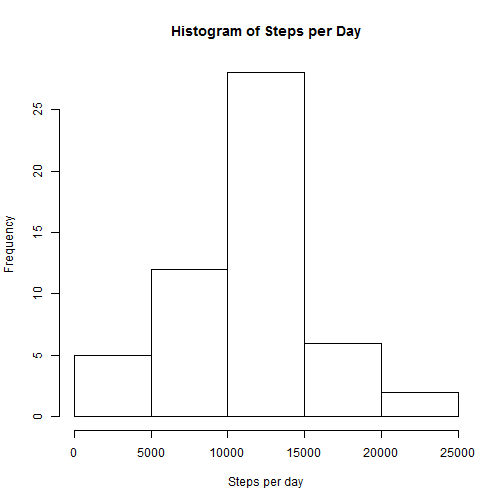
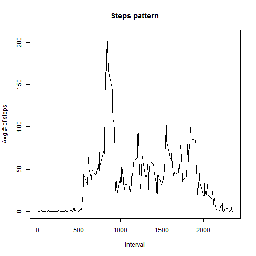
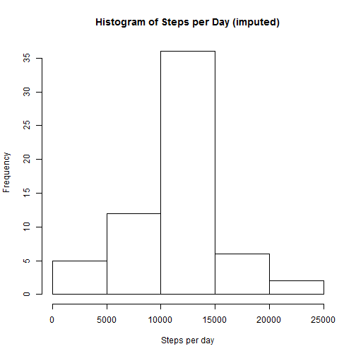
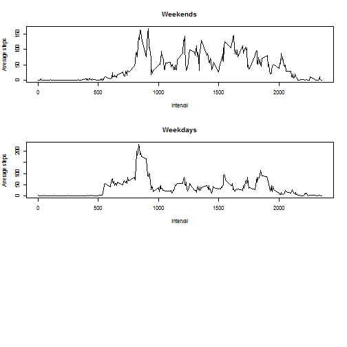

## Loading and preprocessing the data

```r
activity <- read.csv("activity.csv")
activity$date=as.Date(activity[,2])
```


## What is mean total number of steps taken per day?
In this step I'm ignoring missing values as per the assignment instructions.

First, aggregate data by day:

```r
ad = aggregate(activity$steps, by=list(activity$date), FUN=sum,na.rm=TRUE)[2]
ad[ad==0]=NaN
```

The mean steps per day:

```r
ms=mean(ad$x,na.rm=TRUE)
ms
```

```
## [1] 10766.19
```
The median steps per day:

```r
meds=median(ad$x,na.rm=TRUE)
meds
```

```
## [1] 10765
```


```r
hist(ad$x,xlab="Steps per day",main="Histogram of Steps per Day")
```

 

## What is the average daily activity pattern?
Aggregate by interval:

```r
ai=aggregate(steps~interval,data=activity,FUN=mean,na.rm=TRUE)
```


```r
plot(ai$interval,ai$steps,type="l",xlab="interval",ylab="Avg.# of steps",main="Steps pattern")
```

 

The interval with maxiumum average steps:

```r
ai$interval[which.max(ai$steps)]
```

```
## [1] 835
```


## Imputing missing values

I'll set the missing steps to the average steps taken in this interval across all day, which was already calculated above.

```r
act=merge(activity,ai,by="interval")
act$steps.x[is.na(act$steps.x)]=act$steps.y[is.na(act$steps.x)]
```

Again, aggregate data by day:

```r
ad1 = aggregate(act$steps.x, by=list(act$date), FUN=sum,na.rm=TRUE)[2]
```

The mean steps per day:

```r
mesimp=mean(ad1$x,na.rm=TRUE)
mesimp
```

```
## [1] 10766.19
```
The median steps per day:

```r
medsimp=median(ad1$x,na.rm=TRUE)
medsimp
```

```
## [1] 10766.19
```

The mean didn't change from the first part of the assignment, while the median increased slighly and became equal to mean. 

Since I used the average steps per interval to impute the missing values the bin in the histogram which conatins average number of steps per day is higher than before. There were a few days with missing data which were not counted previously. Now they'll enter the calulation with average number of steps taken.


```r
hist(ad1$x,xlab="Steps per day",main="Histogram of Steps per Day (imputed)")
```

 


## Are there differences in activity patterns between weekdays and weekends?

I aggregate data by intervals and by the logical variable which indicates the weekend or not:

```r
act$wd=grepl("Sat|Sun",weekdays(act$date,abbr = TRUE))
ai1=aggregate(steps.x~interval*wd,data=act,FUN=mean)
```


```r
par(mfrow=c(3,1))
plot(steps.x~interval,data=ai1[ai1$wd,],type="l",xlab="interval",main="Weekends",ylab="Average steps")
plot(steps.x~interval,data=ai1[!ai1$wd,],type="l",xlab="interval",main="Weekdays",ylab="Average steps")
```

 

